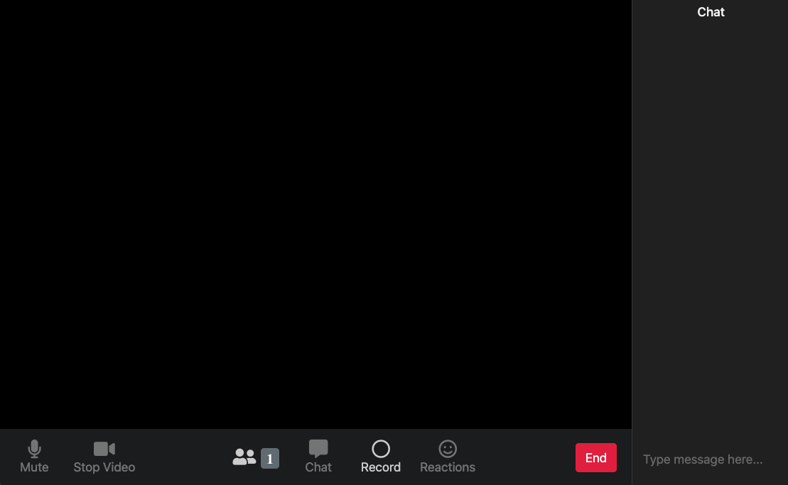

# Frotend da Aplicação

Esta é a aplicação base, vista pelo usuário comum. A página inicial é apenas um template, sem funcionalidades. Ela serve apenas para você criar ou se unir a uma sala, e assim usufriur da aplicação.

Na página de sala, o usuário pode conversar em tempo real com outros usuários que entrem na sala. É possível também criar no botão Record para gravar a chamada, e no botão End para finalizá-la e baixar os arquivos de vídeo gerados com ela.

## Página Inicial

## Sala

### Créditos

- Layout da home foi baseada no codepen do [Nelson Adonis Hernandez
](https://codepen.io/nelsonher019/pen/eYZBqOm)
- Layout da room foi adaptado a partir do repo do canal [CleverProgrammers](https://github.com/CleverProgrammers/nodejs-zoom-clone/blob/master/views/room.ejs)
